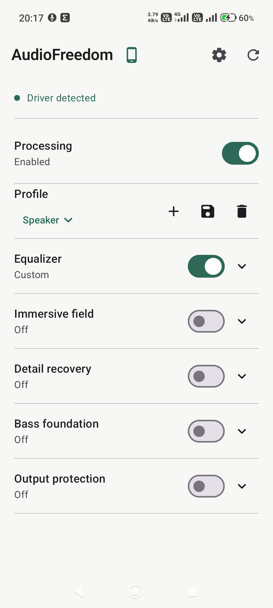
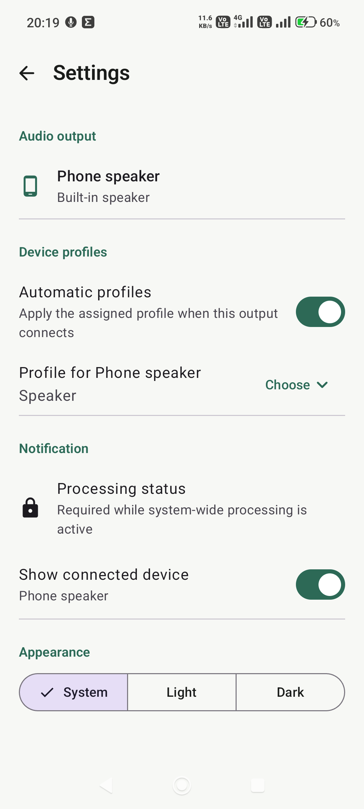
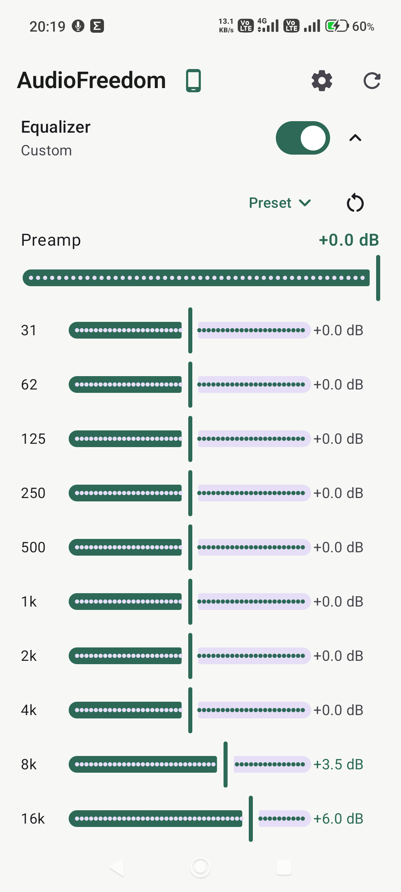
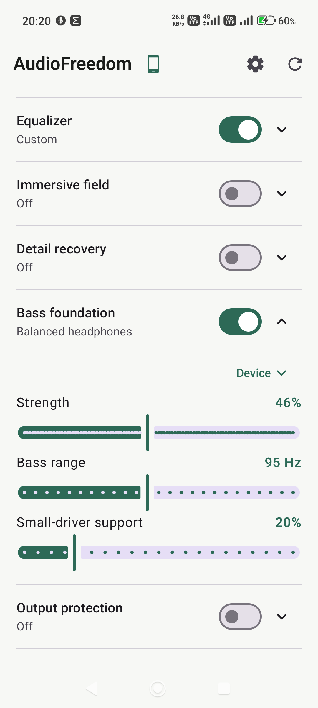
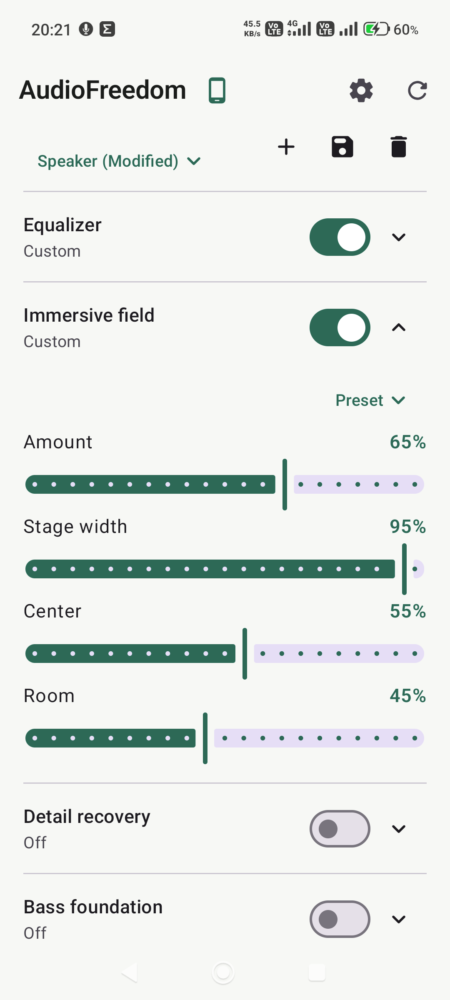

# AudioFreedom

AudioFreedom is an independently implemented, system-wide DSP effect for rooted Android
15 and newer. It combines a platform-independent audio engine, Android AIDL and legacy
effect adapters, a capability-selected root module, and a companion controller app.

AudioFreedom does not contain ViPER4Android code, binaries, branding, presets, or assets.
Its current DSP algorithms, protocol, UUIDs, Android integration, and user interface were
implemented specifically for this project.

AudioFreedom is experimental software for rooted devices. Audio-stack implementations
vary between Android versions, ROMs, and vendors, and offloaded playback may bypass the
software effect chain.

## Screenshots

| Main controls | Settings |
| --- | --- |
|  |  |

| Equalizer | Bass foundation |
| --- | --- |
|  |  |

| Immersive field |
| --- |
|  |

## Features

- System-wide session-0 processing controlled by a foreground service
- Ten-band constant-Q equalizer with preamp and persistent presets
- Bass Foundation with deep-band lift, adaptive restraint, and small-driver support
- Transient-aware Detail Recovery with linked stereo decisions
- Immersive Field with width, center, room, crossfeed, and early-reflection processing
- Linked-channel output limiter with configurable ceiling and release
- Live input, output, and gain-reduction meters
- Named profiles with optional automatic assignment by connected output
- Phone speaker, wired, USB, HDMI, and Bluetooth route awareness in the app and notification
- System, light, and dark themes
- Automatic bypass outside Android's normal audio mode

## Compatibility

The universal root module selects its backend from the active Android Effects Factory and
process ABI. It has no manufacturer, model, product, or serial-number allowlist.

Validated reference stacks:

- Xiaomi 15 Ultra on Android 16 / HyperOS with a 64-bit Stable AIDL Effects Factory
- Sony Xperia 1 III on LineageOS 23 with a 32-bit classic HIDL Effects Factory

Speaker and Bluetooth processing, persistent control, and live parameter updates have
been confirmed during development. Compatibility still depends on the device's effect
factory, XML configuration, linker rules, SELinux policy, and playback route. Compressed
or Bluetooth hardware offload can bypass AudioFlinger software effects and must be tested
separately.

The installer preserves the device's existing sound-effect libraries, patches copies of
device-owned effect configurations, and mounts those copies systemlessly. It does not use
Xiaomi, Qualcomm, Dolby, or other manufacturer DSP algorithms.

See [Reference devices](docs/REFERENCE_DEVICES.md) and
[Architecture](docs/ARCHITECTURE.md) for integration details and current boundaries.

## Repository layout

- `core/`: platform-independent, real-time-safe DSP
- `protocol/`: versioned parameter and status protocol
- `platform/aidl/`: Android Stable AIDL effect backend
- `platform/legacy/`: classic Android effect-library backend
- `platform/controller/`: Android-versioned output-mix controller
- `app/`: companion Android controller
- `module/package-universal/`: universal root-module template
- `tests/`: native DSP and protocol tests
- `tools/`: build, packaging, diagnostics, and device-test scripts
- `docs/`: architecture, reference-device notes, and acceptance tests

Generated builds, device diagnostics, OEM files, and historical private artifacts are
excluded from source control.

## Build the app

Open the repository in Android Studio, or build the debug APK from PowerShell:

```powershell
.\gradlew.bat :app:assembleDebug
```

The app currently targets Android API 36 and has a minimum SDK of 35.

## Run native tests

```sh
cmake -S . -B out/build -DAUDIOFREEDOM_BUILD_TESTS=ON
cmake --build out/build
ctest --test-dir out/build --output-on-failure
```

An ARM64 Android build of the native tests can be run on one connected device without
root:

```powershell
.\tools\run-native-tests.ps1 -Serial <device-serial>
```

## Root module

The universal package combines AIDL64, legacy64, and legacy32 effect binaries and selects
the compatible backend during installation:

```powershell
.\tools\build-universal-module.ps1
```

The packaging command expects the native backend libraries and probes at the paths shown
by the script parameters. Building the AIDL backend outside an AOSP or LineageOS tree
requires staged Android effect-framework sources; see `tools/stage-aosp.sh`.

Installing the module requires Magisk, KernelSU, or a compatible root-module manager and
a reboot. Disabling or uninstalling the module and rebooting removes its systemless
mounts. Back up important data before testing any root module.

## Licensing

AudioFreedom's original source is publicly visible but is not open-source software at
this stage. All rights are reserved; see [LICENSE](LICENSE). Third-party portions retain
their own licenses and attribution in [THIRD_PARTY_NOTICES.md](THIRD_PARTY_NOTICES.md).

Private `0.8.x` experiments are not part of this repository or its releases. Their
separate personal-use restriction is recorded in
[Historical personal-use ViPER DSP notice](docs/PERSONAL_USE_VIPER_NOTICE.md).
